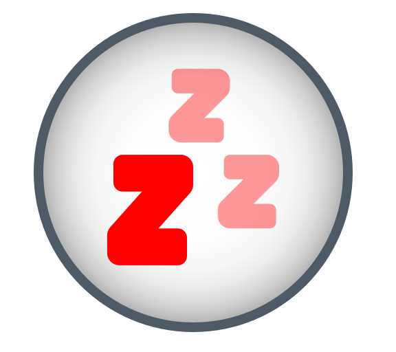

# Resting State
<p style="float:left">
  
</p>

[](https://github.com/neuromotion/resting-state/actions)
[](https://github.com/neuromotion/resting-state/actions)

## Overview

This repo contains the Resting State task. It is a [jspsych](https://www.jspsych.org/) task built with React and Electron. This task uses [Honeycomb](https://brown-ccv.github.io/honeycomb-docs/).

The task involves several relaxed tasks: following a moving dot with one's eyes, responding to beeps, and fixating on a dot.

## Quickstart

1. Clone the repo

```git clone https://github.com/neuromotion/resting-state.git```
2. Navigate to the directory

```cd resting-state```
3. Install `npm` packages (`-D` installs development dependencies in addition to production ones)

```npm install -D```
4. Run in development mode

```npm run dev```